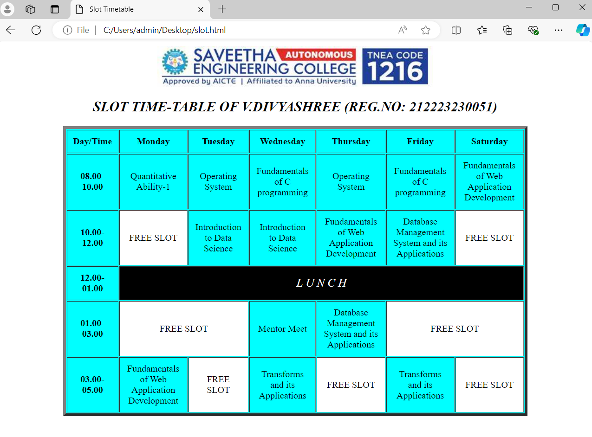

# Ex03 Time Table
## Date: 03.10.2024

## AIM
To write a html webpage page to display your slot timetable.

## ALGORITHM
### STEP 1
Create a Django-admin Interface.

### STEP 2
Create a static folder and inert HTML code.

### STEP 3
Create a simple table using ```<table>``` tag in html.

### STEP 4
Add header row using ```<th>``` tag.

### STEP 5
Add your timetable using ```<td>``` tag.

### STEP 6
Execute the program using runserver command.

## PROGRAM
## Developed by 
## Name: V.DIVYASHREE
## Reg.No: 212223230051
```
<html>
    <head>
        <title> Slot Timetable</title>
    </head>
    <body>
        <center>
        
        <h2 style="font-style:oblique;">
            SLOT TIME-TABLE OF V.DIVYASHREE (REG.NO: 212223230051)
        </h2>
    </center>
    <table align="center" width="800" cellspacing="2" cellpadding="10px" border="5" bgcolor="aqua">

        <tr align="center">
            <th>Day/Time</th>
            <th>Monday</th>
            <th>Tuesday</th>
            <th>Wednesday</th>
            <th>Thursday</th>
            <th>Friday</th>
            <th>Saturday</th>
        </tr>
        <tr align="center">
            <th>08.00-10.00</th>
            <td>Quantitative Ability-1</td>
            <td>Operating System</td>
            <td>Fundamentals of C programming</td>
            <td>Operating System</td>
            <td>Fundamentals of C programming</td>
            <td>Fundamentals of Web Application Development</td>
        </tr>
        <tr align="center">
            <th>10.00-12.00</th>
            <td bgcolor="white" >FREE SLOT</td>
            <td>Introduction to Data Science</td>
            <td>Introduction to Data Science</td>
            <td>Fundamentals of Web Application Development</td>
            <td>Database Management System and its Applications</td>
            <td bgcolor="white">FREE SLOT</td>
        </tr>
        <tr align="center">
            <th>
                12.00-01.00
            </th>
            <td colspan="6" bgcolor="black"style="color:white;font-size:20px;font-style:italic;">L  U  N  C  H</td>
        </tr>
        <tr align="center">
            <th>01.00-03.00</th> 
            <td colspan="2" bgcolor="white">FREE SLOT</td>  
            <td>Mentor Meet</td> 
            <td>Database Management System and its Applications</td>   
            <td colspan="2" bgcolor="white">FREE SLOT</td>
         </tr>
         <tr align="center">
            <th>03.00-05.00</th>
            <td>Fundamentals of Web Application Development</td>
            <td bgcolor="white">FREE SLOT</td>
            <td>Transforms and its Applications</td>
            <td bgcolor="white">FREE SLOT</td>
            <td> Transforms and its Applications</td>
            <td bgcolor="white">FREE SLOT</td>
         </tr>
    </table>
    </body>
</html>
```


## OUTPUT



## RESULT
The program for creating slot timetable using basic HTML tags is executed successfully.
